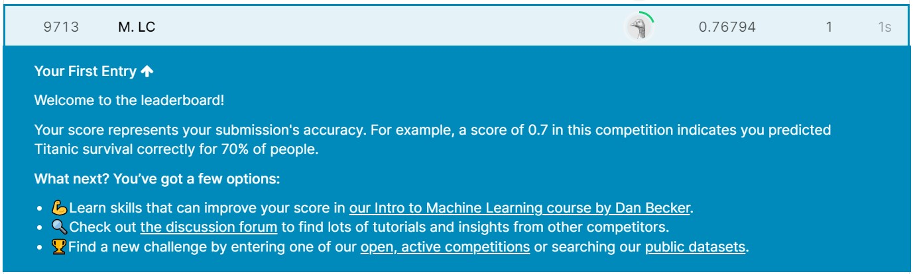

# Machine Learning Project - Kaggle Titanic Competition

### Background on my code files
We will go through my first Kaggle competition project, the `Titanic - Machine Learning from Disaster`. In this project, we are going to follow the following workflow:

1. Download and load the data given by the site: `train.csv` and `test.csv`.
2. Inspect the data to analyze any relationship between the features.
3. Preprocess any discrete, nominal and string data.
4. Fit and compare models using cross-validation (using our defined functions).
5. Apply hyperparameter tuning using grid search (using our defined functions) to find the best model.
6. Retrain best model on data and predict test data.
7. Submit predicted results to Kaggle and conclude my interpretations.
8. Reflect on this mini-project experience.

Please go to `ProjectAnalysis.ipynb` file and follow along the instructions in the file to run the code. It contains more details for each step of the workflow.

### How to run your code, guide to install any additional packages
There are no additional packages to install other than importing the necessary libraries that is indicated in the jupyter notebook.

### Results, interpretation and reflection
Completion and submission of my first Kaggle competition was succesfull. Please go and read details at the end of my `ProjectAnalysis.ipynb` file. 

Screenshot from first submission:

 
